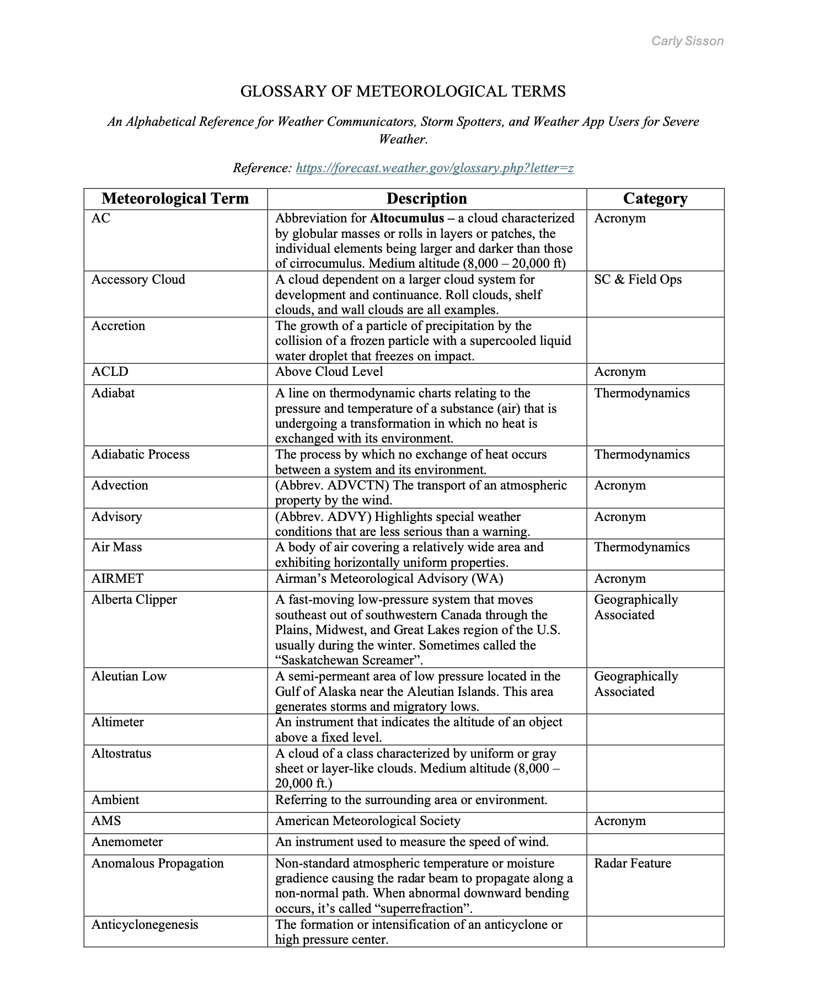

# Welcome to the Meteorological Glossary for Severe Weather!

This collection is designed as a reference for meteorologists, storm chasers, weather enthusiasts, and anyone interested in learning the terminology used in weather forecasting and severe storm analysis. This repository contains detailed definitions and explanations of meteorological terms, organized alphabetically for easy reference.
---
## Access the Glossaries

Click on the links below to jump directly to the glossary segment you want:

- [A–C](docs/glossary-a-c.md)
- [D-F](docs/glossary-d-f.md)
- [G-I](docs/glossary-g-i.md)
- [J-L](docs/glossary-j-l.md)
- [M-O](docs/glossary-m-o.md)
- [P-R](docs/glossary-p-r.md)
- [S-U](docs/glossary-s-u.md)
- [V–Z](docs/glossary-V-Z.md)

---
### Example PDF

